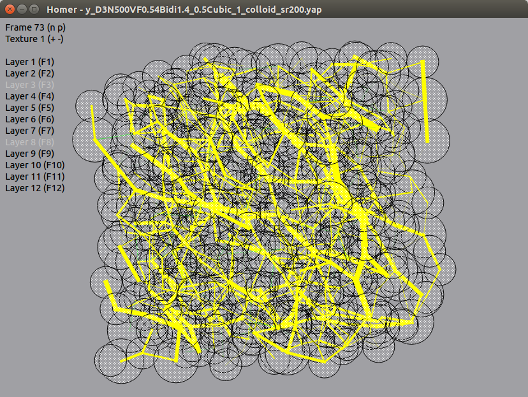

<h1> Homer </h1>

Version 0.4, Feb. 3, 2016



Homer is a program to visualize computer simulations data (typically
Molecular Dynamics data) in an easy manner. It is developed to replace
[Yaplot](https://github.com/vitroid/Yaplot), mainly because Yaplot's
code depends on X, which can make it hard to install
on a recent machine. Homer is thus mostly a clone of Yaplot, based on
the same idea of a simple set of commands interpreted to render an
intentionally basic representation of 3D data.

So far not all of Yaplot features
are available. As of v0.4, Yaplot-style command files containing
lines, sticks, circles, polygons and texts are processed by Homer. The
layer, color and radius commands are supported. Most display features
offered by Yaplot are available, the only notable exception being the
perspective control. Also the possibility to display multiple input
files is still very primitive in Homer. As an original feature,
on can translate the field of view, or add a title text.

<h2> Installation </h2>

Homer needs a Python 3 interpreter and the numpy and PyQt4
packages. You can install these packages individually or get them through a Python distribution like [Anaconda](https://store.continuum.io/cshop/anaconda/).


You can run Homer as follows:

```
$ python path_to_homer/src/homer.py your_command_file
```

<h2> Data format </h2>

Currently, Homer supports the following subset of Yaplot's data format:

| Command | Result |
|---------|--------|
| Empty line | New frame |
| @ [0-9] | Set the color of following objects (see default color palette below) |
| y [1-12] | Set the layer of following objects |
| r x | Set the thickness/radius of following objects to x |
| l x1 y1 z1 x2 y2 z2 | Draw a line from 1 to 2 |
| s x1 y1 z1 x2 y2 z2 | Draw a stick (line with thickness) from 1 to 2 |
| c x y z | Draw a circle centered on x,y,z |
| p n x1 y1 z1 ... xn yn zn | Draw a n-point polygone |
| t x y z s | Print text string s on x,y,z |
| tt s | Print title string s |

Default colors:

| Index | Color |
|-------|-------|
| 0 | Qt.black |
| 1 | Qt.gray |
| 2 | Qt.white |
| 3 | Qt.green |
| 4 | Qt.yellow |
| 5 | Qt.red |
| 6 | Qt.blue |
| 7 | Qt.magenta |
| 8 | Qt.darkGreen |
| 9 | Qt.cyan |

User can override this default palette. Just create a file called
`homer_palette.py" in the directory where you launch homer. In this
file, you can define a color palette as, for example:
```
from PyQt4.QtCore import Qt
from PyQt4.QtGui import QColor

color_palette = [ Qt.black, Qt.gray, Qcolor(200,200,200,100), ... ]
```
The number of colors is unlimited. Colors must be [Qt colors](http://qt-project.org/doc/qt-4.8/qcolor.html).

<h2> Control commands </h2>

| Command | Result without prefix | Result with number i prefix |
|---------|------------------------------|---------------------------|
| Mouse left-button drag  | Rotate field of view | - |
| Shift + Mouse left-button drag  | Translate field of view | - |
| Tab | Reset rotation and translation | - |
| * | Zoom in | - |
| / | Zoom out | - |
| + | Increase opacity | - |
| - | Decrease opacity | - |
| n | Next frame | Move forward by i frames |
| p | Previous frame | Move backward by i frames |
| N | Forward movie | Framerate i |
| P | Backward movie | Framerate i |
| Space | Stop movie | - |
| g | Move to the first frame | Move to frame i |
| G | Move to the last frame | - |
| [F1 - F12] | Switch on/off layer [1-12] | - |
| v | Switch on/off information text | - |
| Up-Down-Left-Right | Rotate field of view | - |
| Shift + Up-Down-Left-Right | Rotate field of view by 90 deg | - |
| Return | Repeat previous command |